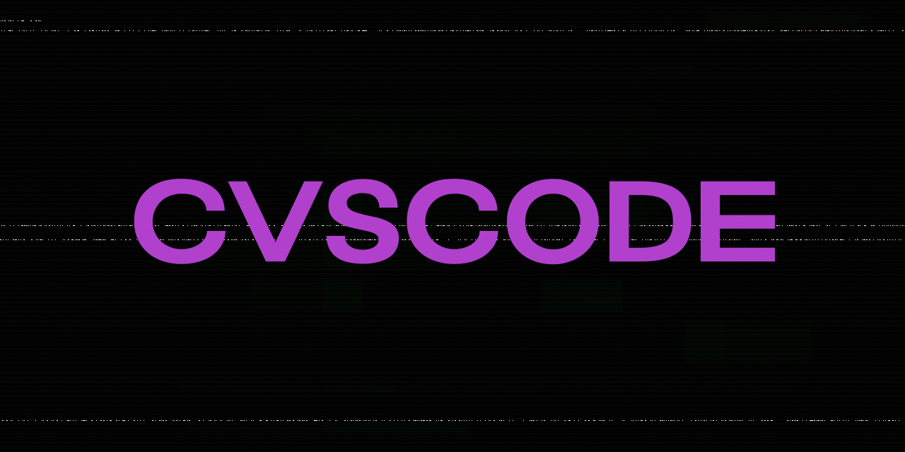

# CVSCode



CVSCode is a simple scripting language that is built with TypeScript, made by CVS0. It uses Deno to launch the Repl, from that you can use the CVSCode command line interface to launch / debug your  CVSCode scripts.

# Features:

- **Let / Const Variables:** This project allows you to declare and use variables using the "let" and "const" keywords, similar to JavaScript and TypeScript, providing flexibility and scope control.

- **Frequent Updates:** We are committed to providing frequent updates to enhance and improve the project, ensuring it remains up to date with the latest developments.

- **High Performance:** This project is designed for speed, offering a fast and efficient programming experience.

- **Detailed Error Logs:** In case of errors, the project provides detailed error logs to assist developers in diagnosing and resolving issues quickly.

- **JavaScript/TypeScript-Like Syntax:** This language features a syntax that's familiar to JavaScript and TypeScript developers, making it easy to transition and work with.

- **Custom User-Defined Functions:** Create your own custom functions, allowing you to encapsulate and reuse code efficiently.

- **Objects:** Utilize objects to structure and organize your data, providing a convenient way to work with complex data.

- **User-Defined Structures:** Define custom data structures tailored to your specific needs for data organization.

- **Function Calls:** Implement function calls to execute code blocks and achieve various tasks within your projects.

- **Object Member Expressions:** Access and manipulate object properties and members using intuitive expressions.

- **Conditional Statements:** Use "if" statements to add logic and control flow to your code, enhancing decision-making capabilities.

- **Else Statements:** Complement "if" statements with "else" for handling alternative scenarios and further control flow.

- **Comments:** Add comments to your code for documentation and clarification, making it easier for both yourself and others to understand the codebase.

These features collectively make CVSCode a versatile and powerful programming language for a wide range of applications.

# TODO:

- **Loops:** We are actively working on adding support for loops.

# Credits:

This project is made possible by the contributions and efforts of the following individuals:

- **cvs0:** Lead developer and creator of CVSCode.
- **tlaceby:** Provided lots of assistance in the creation of CVSCode.

# How to use:
## How to Launch the REPL (Read-Eval-Print-Loop):
    Clone the CVSCode github repository to your local machine with this command:
    ```bash
    git clone https://github.com/cvs0/cvscode.git
    ```

    Navigate to the CVSCode directory that we just downloaded the project to:
    ```bash
    cd cvscode
    ```

    Start the REPL interface;
    ```bash
    deno run -A main.ts
    ```

    Run your script (while in the REPL interface):
    ```bash
    run <filename>.cvs
    ```

# Language-basics

* Basic output program:
    ```typescript
    let x = 25;

    if (x == 25) {
        print("X is 25.")
    }
    ```

* Operators:
    ```typescript
    let x = 25;
    let y = 20;

    if (x + y == 45) {
        print("Result was true.")
    }
    ```

# Known-Issues

* The run file command only works inside VSCode integrated terminal:
    ```bash
    run <filename>.cvs
    ```
    
* Some issues with the strict operators inside if statements. (===, !==).

# Legal

## License

This project is licensed under the MIT License.

### MIT License

The MIT License is a permissive open-source license that allows you to freely use, modify, and distribute this project as long as you include the original copyright notice and disclaimers. 

For more details on the MIT License, please refer to the [LICENSE](LICENSE) file in this repository.

## Contributors

We welcome contributions from the community. By contributing to this project, you agree to release your contributions under the terms of the MIT License. See [CONTRIBUTING.md](CONTRIBUTING.md) for guidelines on how to contribute.

## Disclaimer

This project is provided as-is, and the authors and contributors are not liable for any issues or damages that may arise from its use. For more information, please read our [DISCLAIMER](DISCLAIMER.md) statement.

